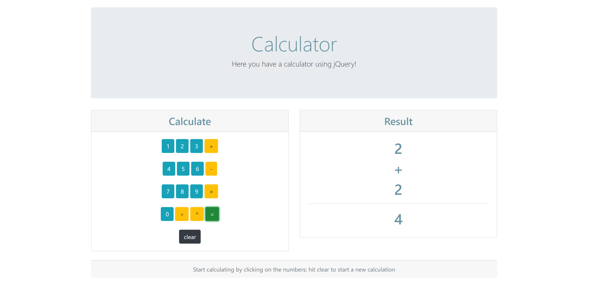

# jQuery Calculator

This is a basic calculator that you can use to sum, divide, substrac, multiply and find the exponential value of two sets of numbers. It works like any calculator would, the user selects a first number, selects an operator, a second number and then gets the result. 

## Technology used

This web based application uses jQuery as a JavaScript library. We also used Bootstrap for the design and container layout and some minor CSS editing. 

https://getbootstrap.com/

## Special Thanks to:

 https://icons8.com/ - Icons
 

## Links:

Go to application: https://cookiechef.github.io/jQuery_Calculator/

Github repository:https://github.com/CookieChef/jQuery_Calculator.git

